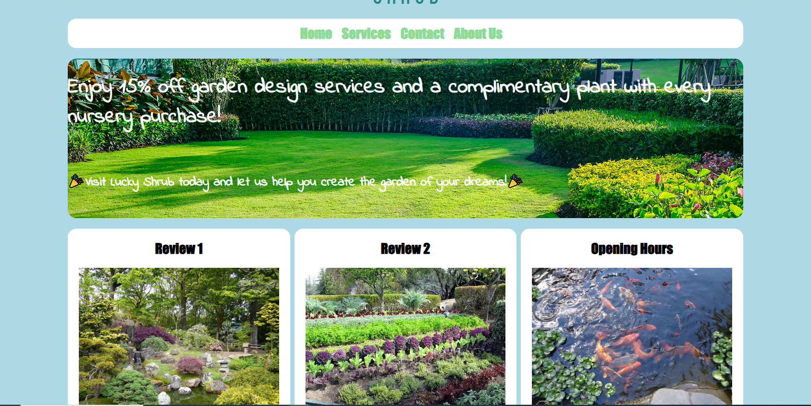

# Website for Lucky Shrub
A web application developed for a fictional gardening company utilizing HTML, CSS, and JavaScript. This digital platform aims to enhance brand visibility and drive revenue growth by fostering improved market outreach and sales expansion.

## How to Open
1) git clone https://github.com/RichieVuong/funWebsite.git
2) Type cd funWebsite
3) Type code .
4) Preview index.html
5) Look around site! 

## Preview

Small snipit of the website

